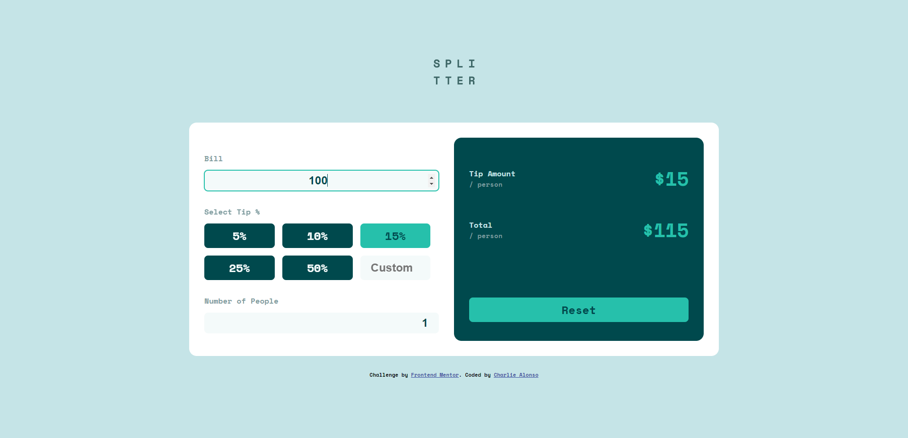
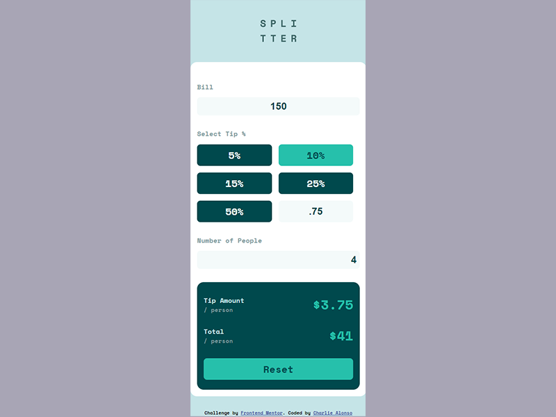

# Frontend Mentor - Tip calculator app solution

This is a solution to the [Tip calculator app challenge on Frontend Mentor](https://www.frontendmentor.io/challenges/tip-calculator-app-ugJNGbJUX). Frontend Mentor challenges help you improve your coding skills by building realistic projects.

## Table of contents

- [Frontend Mentor - Tip calculator app solution](#frontend-mentor---tip-calculator-app-solution)
  - [Table of contents](#table-of-contents)
  - [Overview](#overview)
    - [The challenge](#the-challenge)
    - [Screenshot](#screenshot)
    - [Links](#links)
  - [My process](#my-process)
    - [Built with](#built-with)
    - [What I learned](#what-i-learned)
    - [Continued development](#continued-development)
  - [Author](#author)

**Note: Delete this note and update the table of contents based on what sections you keep.**

## Overview

### The challenge

Users should be able to:

- View the optimal layout for the app depending on their device's screen size
- See hover states for all interactive elements on the page
- Calculate the correct tip and total cost of the bill per person

### Screenshot

### Links

- Solution URL: [Tip Calculator App repo](https://github.com/Charlie025x/Tip-calculator-app)
- Live Site URL: [Tip Calculator Live Site](https://charlie025x.github.io/Tip-calculator-app/)

## My process

### Built with

- Semantic HTML5 markup
- CSS custom properties
- Flexbox
- Mobile-first workflow
- [React](https://reactjs.org/) - JS library

### What I learned

I got good review with React's Click events, rending components via map method, and handling state.

### Continued development

I'm not yet fully comfortable with React but I do feel one step closer, after finishing this calculator.

## Author

- Website - [Charlie Alonso](https://charlie-alonso.netlify.app/)
- GitHub - [Charlie025x](https://github.com/Charlie025x)
- Frontend Mentor - [@Charlie025x](https://www.frontendmentor.io/profile/Charlie025x)
- LinkedIn - [Charliealonso002](https://www.linkedin.com/in/charliealonso002/)
